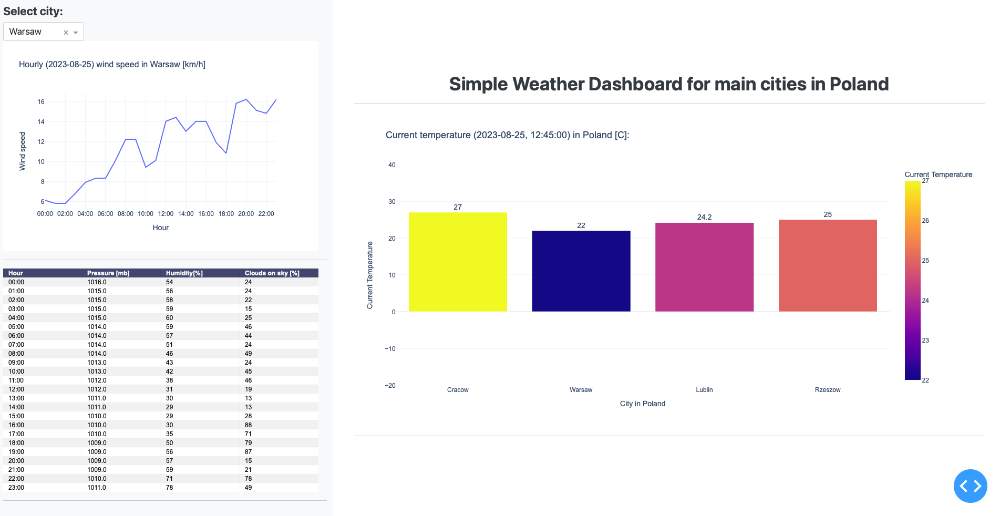

# Dashboard: Weather in main cities in Poland

<aside>
❗ The dashboard is only available in Polish at this point.

</aside>

# Generic

[Link to python script](app.py)

### Introduction

This is a sample dashboard made in Plotly Dash, showing the actual temperature, hourly wind speed, pressure, humidity and cloudiness percentage in main cities in Poland (Cracow, Warsaw, Lublin, Rzeszow). 

### Data and requirements

The data on which the dashboard was prepared was obtained by an API request from weather.api ([https://weatherapi.com](https://weatherapi.com/)).

The environmental requirements to run the script can be found in the [requirements.txt](requirements.txt) file.

### Variables and formulas

| Variable | Information |
| --- | --- |
| Date | date taken from api request |
| Current temperature | in Celsius |
| City | dropdown list of 4 cities: Cracow, Warsaw, Lublin, Rzeszow |
| Wind speed | forecast in km/h |
| Pressure | forecast in mb |
| Humidity | forecast in % |
| Clouds on sky | cloudiness percentage forecast in % |

### Screenshots

